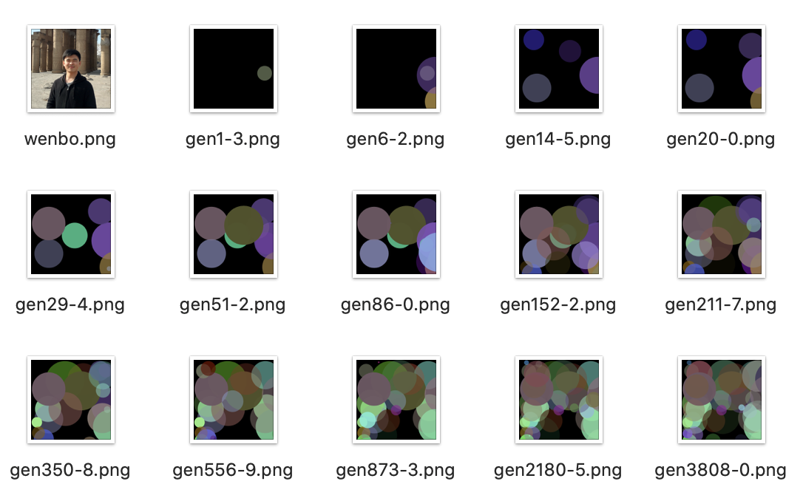

## Genetic Programming

[Edit on Google Colab](https://colab.research.google.com/drive/1fb6oVnU6uQwEq6RPAQhn6aE-U5C3tIGf?usp=sharing)

The procedure of the program is quite simple:

0. Setup a random DNA string  (application start)
1. Copy the current DNA sequence and mutate it slightly
2. Use the new DNA to render polygons onto a canvas
3. Compare the canvas to the source image
4. If the new painting looks more like the source image than the previous painting did, then overwrite the current DNA with the new DNA
5. Repeat from 1

### Reference

- https://rogerjohansson.blog/2008/12/07/genetic-programming-evolution-of-mona-lisa/
- https://github.com/peterbraden/genetic-lisa